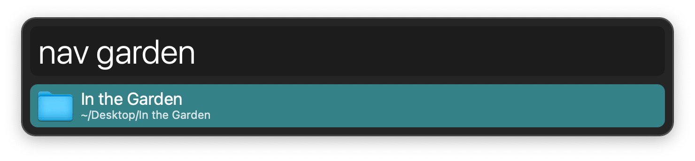
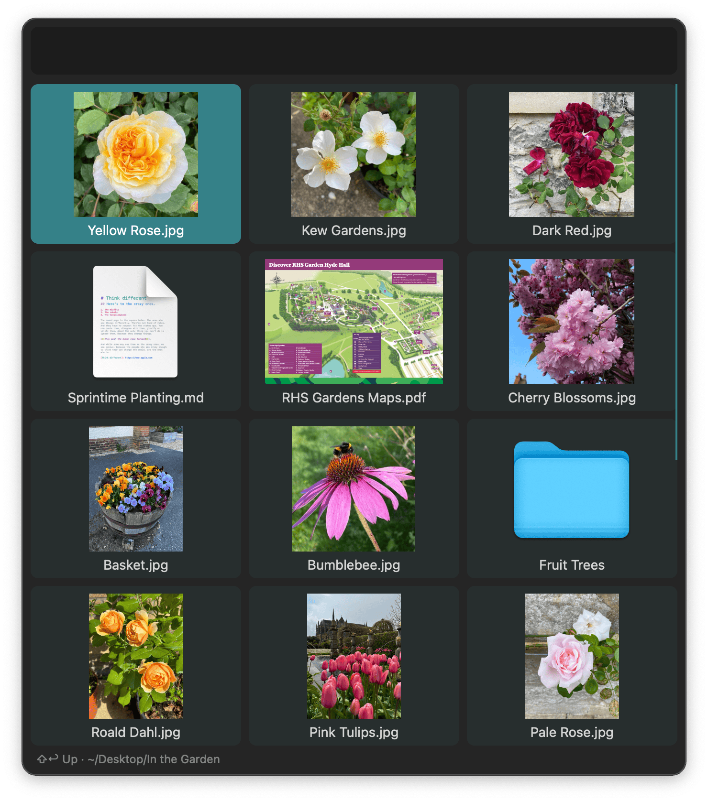
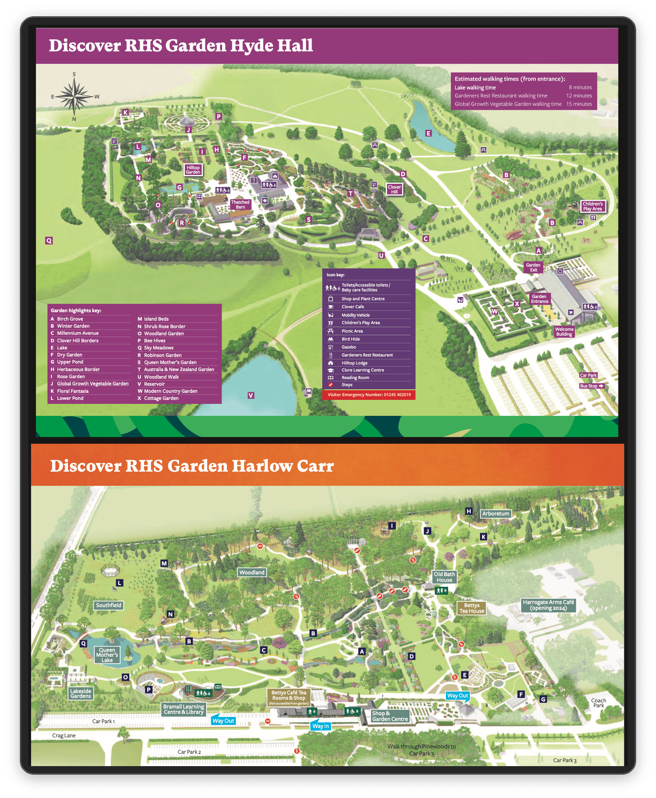
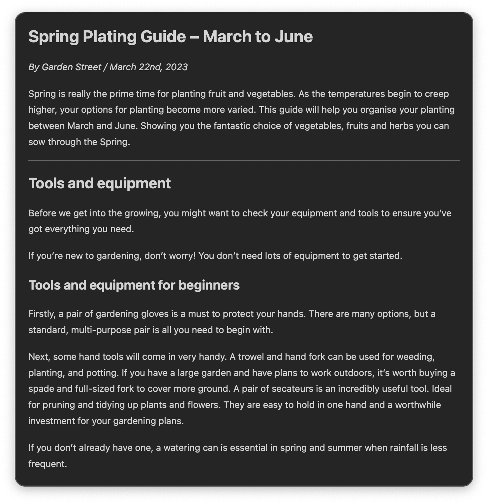
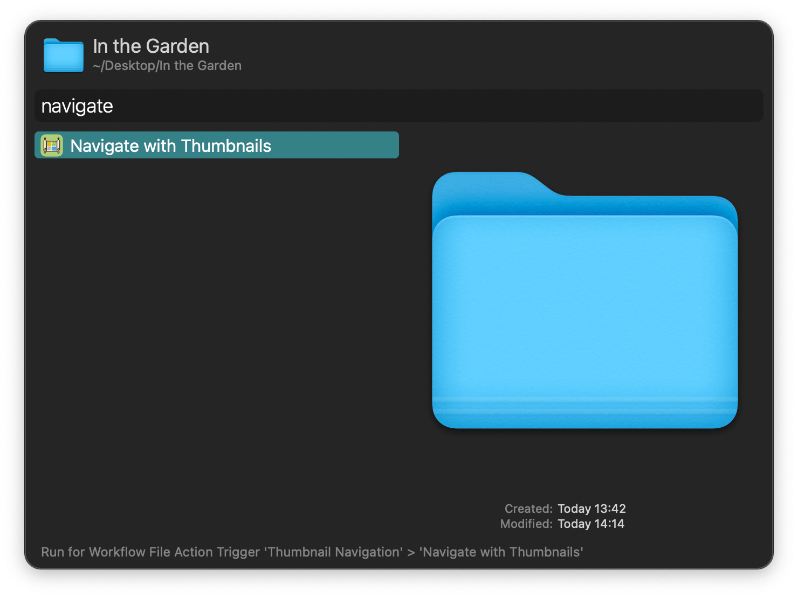

#  Thumbnail Navigation Alfred Workflow

Navigate the file system with previews

[⤓ Install on the Alfred Gallery](https://alfred.app/workflows/alfredapp/thumbnail-navigation)

## Usage

Search for folders with the `nav` keyword and press <kbd>↩&#xFE0E;</kbd> to navigate the contents in a thumbnail view. Type to filter.

* <kbd>↩&#xFE0E;</kbd> Open or view file, or navigate inside folder.
* <kbd>⌘</kbd><kbd>↩&#xFE0E;</kbd> Flip sort order.
* <kbd>⌥</kbd><kbd>↩&#xFE0E;</kbd> Reveal in Finder.
* <kbd>⇧</kbd><kbd>↩&#xFE0E;</kbd> Navigate to parent folder.

Alternatively, begin navigation in a folder via a [Universal Action](https://www.alfredapp.com/help/features/universal-actions/).

Configure the Fast Entry section in the [Workflow’s Configuration](https://www.alfredapp.com/help/workflows/user-configuration/) to start navigation with the contents of specified folders. Launch it via the `fnav` keyword or the [Hotkey](https://www.alfredapp.com/help/workflows/triggers/hotkey/).

